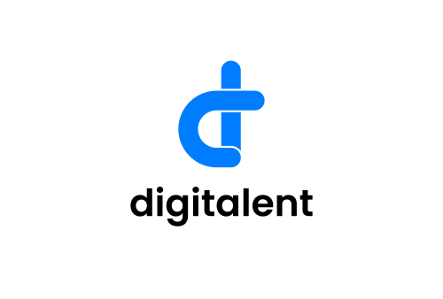
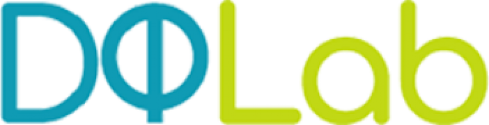

# Kominfo Digitalent x DQLab - Data Analyst

  

Program Digital Talent Scholarship adalah program pelatihan pengembangan kompetensi yang telah diberikan kepada talenta digital Indonesia sejak tahun 2018. Program Digital Talent Scholarship tahun 2021 didesain untuk menciptakan ekosistem seimbang dalam memaksimalkan peran pentahelix (pemerintah, komunitas/masyarakat, institusi pendidikan tinggi, dunia usaha, dan media) untuk menjadi fasilitator dan akselerator pendukung ekonomi digital.

  

 

DQLab adalah portal belajar data yang sangat lengkap. Jika kamu ingin menjadi seorang praktisi data, maka wajib untuk belajar di DQLab. Terdapat tiga bahasa pemrograman yang disediakan, yakni R, Python, dan SQL. Ketiga bahasa tersebut sangat populer di dunia Data Science sekarang ini.
